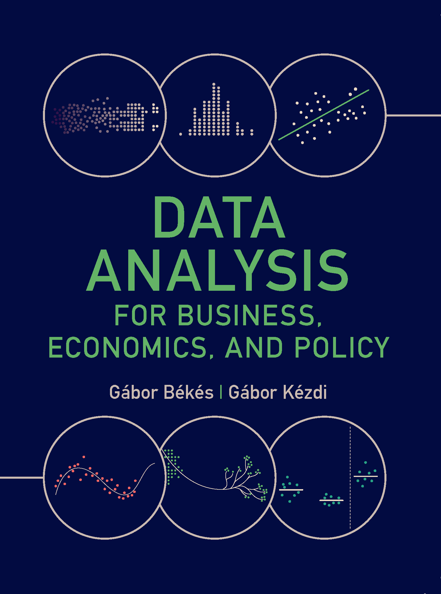
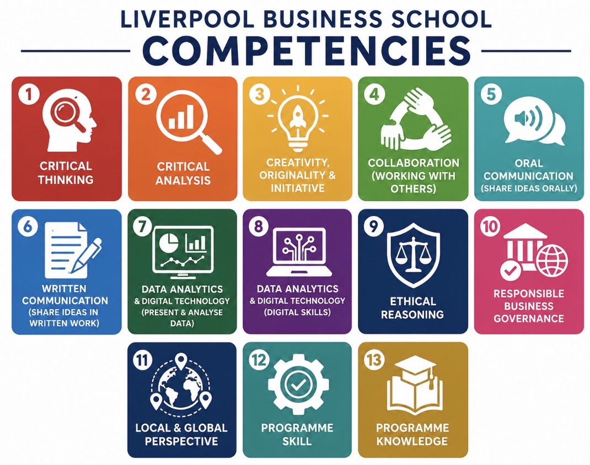
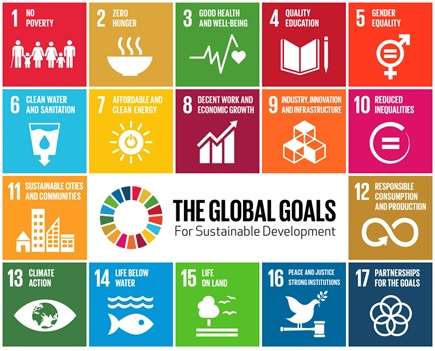

## Welcome

::: {.two-col}
::: {.col style="text-align:center;"}
{.profile-pic width="300" height="300"}
:::
::: {.col}
Welcome to the module. I'm **Dr Steve Nolan**, a Senior Lecturer in Economics here at the Liverpool Business School, and module leader for **Research Methods in Analytics**.

I'm looking forward to meeting you all over the coming weeks. If you'd like to know more about me and my work, my profile page is at [profiles.ljmu.ac.uk/16186-steve-nolan](https://profiles.ljmu.ac.uk/16186-steve-nolan).
:::
:::

::: {.fragment}
This module is the statistical engine room of your MSc. We'll build up from the basics of describing and summarising data, through statistical inference and regression, to the two skills that matter most once you're working with real business data: building a model you can defend, and knowing whether you can actually draw a causal conclusion from it.
:::

## Learning Outcomes

By the end of this module, you will be able to:

1. **Apply and critically appraise** core statistical concepts and analytical techniques to interpret business data, draw meaningful insight, and make informed judgements under uncertainty.
2. **Critically evaluate** the suitability and limitations of different analytical approaches, and assess the credibility and robustness of the findings they produce for business decision-making.
3. **Demonstrate a clear understanding** of how causal claims can be established from data, and use structured reasoning to judge when evidence supports a genuine causal effect in a business context.

::: {.fragment}
Both the exam and the portfolio assess all three outcomes — MLO3 (causal reasoning) is the one that most separates a good analysis from a great one.
:::

## Module Evaluation Survey

::: {.instructions-box}
This is the first delivery of **7002LBSAI**, so there's no "you said, we did" from a previous cohort yet.
:::

What that means in practice:

- I'll be asking for your feedback throughout the semester, not just at the end
- Your response to this year's survey directly shapes next year's module — you'll be the "you said" for the next cohort
- If something isn't working, tell me before the survey — I'd rather fix it in Week 3 than Week 11

## Your timetable

::: {.two-col}
::: {.col}
**Workshop**

Fridays, 1–4pm, Redmonds Building, Room 118

We'll work through that week's ideas together — building intuition first, often through simulation and hands-on tasks, before we get to the formal statistics.
:::
::: {.col}
**Online session**

Thursdays, 1 hour

The following Thursday, we go a bit deeper into the same material.
:::
:::

::: {.instructions-box}
Today's session is a one-off, before teaching starts — that's why we're meeting online first. From Week 1 onwards it's workshop on Friday, online session the following Thursday, every week.
:::

## The semester at a glance {.smaller}

| Wk | Topic | Workshop | Online session |
|----|-------|----------|-----------------|
| 01 | Distributions and Summarising Data | Fri 25 Sep | Thu 01 Oct |
| 02 | Inference | Fri 02 Oct | Thu 08 Oct |
| 03 | Relationships Between Variables | Fri 09 Oct | Thu 15 Oct |
| 04 | Regression I: Fitting the Line | Fri 16 Oct | Thu 22 Oct |
| 05 | Regression I: Model Problems & Inference | Fri 23 Oct | Thu 29 Oct |
| 06 | Regression II: Multiple Regression | Fri 30 Oct | Thu 19 Nov* |
| 07 | *Curriculum Enrichment Week* | – | – |
| 08 | Other Models (GLMs) | Fri 13 Nov | Thu 26 Nov |
| 09 | Causal Analysis and Experiments | Fri 20 Nov | Thu 03 Dec |
| 10 | Prediction | Fri 27 Nov | Thu 10 Dec |
| 11 | Time Series | Fri 04 Dec | – |
| 12 | Portfolio Presentations | Fri 11 Dec | – |

::: {.fragment}
\*Week 6's online session moves to Week 8's slot (19 Nov) — its usual date fell in Curriculum Enrichment Week.
:::

## Practice across the module

Canvas gives you two kinds of practice, running through the semester:

- Every week, a bank of review questions — model answers released the following week
- From around Week 4 onwards, a short set of data exercises too — a downloadable Colab notebook, practising on real data you haven't seen the answer for

Let's have a look at this together on Canvas now.

## How you're assessed {.smaller}

::: {.two-col}
::: {.col}
**Exam — 40%**

Closed-book, two hours.

Section A is compulsory (40 marks). Section B gives you a choice of two from four questions (30 marks each).

University January exam period, 11–21 January — exact date to follow.
:::
::: {.col}
**Portfolio — 60%**

A notebook report (75% of this component): analyse a real-shaped business problem, on a dataset shared across the cohort, in no more than 1,500 words.

A presentation and viva (25%): your own slides, in the Week 12 workshop — 8 minutes, plus 2 minutes of questions.

Notebook due 10am, Friday 11 December. Presentation later that same day.
:::
:::

::: {.fragment}
Both components assess all three learning outcomes for the module.
:::

::: {.fragment}
Both components also assess the competencies marked ✓ later in this session — and the portfolio's employee-attrition case study is itself this module's SDG 8 (Decent Work and Economic Growth) case study.
:::

## Feedback you can expect

::: {.two-col}
::: {.col}
**Exam**

Formative feedback is provided throughout Weeks 1–11 via in-class workshop tasks, with worked-solution reveals and discussion.

Summative feedback will be available through Canvas within 15 working days of the exam.
:::
::: {.col}
**Portfolio**

Formative feedback is provided through hands-on tasks across Weeks 1–8 that build the same statistical judgement skills the portfolio assesses. You also get live feedback during the Week 12 presentation itself, ahead of final grading.

Summative feedback will be available through Canvas within 15 working days of submission.
:::
:::

## Use of AI on this module {.smaller}

This module uses **two different AI tiers**, one per assessment component — you'll need to know which applies to what you're working on.

::: {.two-col}
::: {.col}
::: {style="border:2px solid #1f6fb2; border-radius:10px; overflow:hidden;"}
::: {style="background:#1f6fb2; color:white; text-align:center; padding:8px 4px; font-weight:700; letter-spacing:0.03em;"}
TIER 1 — NO AI USE
:::
::: {style="padding:12px 16px; font-size:0.82em;"}
**Exam** — closed-book, invigilated, two hours.

No AI tools are permitted or accessible during the assessment. AI use is not a relevant consideration for this component.
:::
:::
:::
::: {.col}
::: {style="border:2px solid #e8792a; border-radius:10px; overflow:hidden;"}
::: {style="background:#e8792a; color:white; text-align:center; padding:8px 4px; font-weight:700; letter-spacing:0.03em;"}
TIER 2 — ASSISTIVE AI USE
:::
::: {style="padding:12px 16px; font-size:0.82em;"}
**Portfolio** — technical notebook, presentation and viva.

Students can use AI to support in coding — as you would in a real-life setting — but the analysis and statistical reasoning must be your own. You'll have to defend your choices in the presentation and viva.
:::
:::
:::
:::

::: {.fragment}
Whichever tier applies, three things matter:

**Process** — how AI can be used, including which tools and instructions. **People** — what you add: your own critical thinking and decisions alongside any AI output. **Product** — the final work: can you be confident it's your own, and does it follow these guidelines?
:::

## AI Declaration {.smaller}

::: {.instructions-box}
If your assessment is **Tier 2** (the portfolio), include a declaration like this in your submission.
:::

::: {.two-col}
::: {.col}
**Template**

**Acknowledgement of tools used**: I acknowledge the use of [AI tool or technology name] [link] to generate…/ I have not used any AI tools or technologies to prepare this assessment.

**How the tool was used**: examples may include "I discussed the topic to develop my argument", "I generated tables to visualise my data", "I requested proofreading advice on my grammar".

**Records available**: a full record of prompts and outputs is available upon request.
:::
::: {.col}
**Example**

I acknowledge the use of Microsoft Copilot to brainstorm my essay argument.

I prompted the model to ask me clarifying questions about my draft and the flow of my logic. I used the output to refine my central thesis statement and to decide how to order the argument for my essay.

A full record of prompts and outputs is available upon request.
:::
:::

## What you can use AI for in this module {.smaller}

A general framework for where AI fits into your learning (Zhou and Schofield, 2024):

| Know & Understand | Use & Apply | Value & Create | AI Ethics |
|---|---|---|---|
| Understand | Apply AI for research | Evaluating data types and quality | Evaluate clear AI assessment policies |
| Explore | Systematic literature review | Dataset evaluation | Explain the ethical implications of Gen AI |
| Take notes | Information search | Practical data manipulation and analysis | Discuss AI hallucination |
| Brainstorm | Problem-solving | Complex information search | Apply and adopt Gen AI ethically |
| Mind mapping | Data visualisation | AI in evaluating societal challenges | Co-creating AI ethics |
| Writing, summary | Data analysis | | |

::: {.fragment}
::: {.instructions-box}
In **7002LBSAI** specifically: AI can support brainstorming, literature/data search, and — for the Tier 2 portfolio only — coding and data visualisation. The statistical reasoning, the judgement calls, and the write-up must be yours. For the Tier 1 exam, none of this applies: no AI, full stop.
:::
:::

## Your textbook {.smaller}

::: {.two-col}
::: {.col}
{height="450"}
:::
::: {.col}
Our primary textbook is **Gábor Békés and Gábor Kézdi, *Data Analysis for Business, Economics, and Policy*** (Cambridge University Press, 2021).

This module is built around the book, not just referencing it. Békés and Kézdi teach through real case studies rather than starting with formulas, and I've taken the same approach here.

I'd recommend getting a copy.
:::
:::

::: {.fragment}
::: {.instructions-box}
The authors have made all the data and code freely available at [gabors-data-analysis.com](https://gabors-data-analysis.com), whether or not you own a copy: raw and cleaned datasets, working Python/R/Stata code for all 47 case studies, and slides, practice questions, and interactive dashboards.
:::
:::

## Competencies this module builds {.smaller}

::: {.two-col}
::: {.col style="text-align:center;"}
{height="380"}
:::
::: {.col}
| Competency | Introduced | Developed | Assessed |
|---|:---:|:---:|:---:|
| Critical Thinking and Analysis | ✓ | ✓ | ✓ |
| Creativity, Originality, and Initiative | | ✓ | ✓ |
| Data Analytics and Use of Digital Technology | ✓ | ✓ | ✓ |
| Ethical Reasoning and Responsible Business Governance | | | |
| Local and Global Perspectives | | | |
| Programme Specific Knowledge | ✓ | ✓ | ✓ |
| Programme Specific Skills | ✓ | ✓ | ✓ |
:::
:::

::: {.fragment}
**Introduced** — the basics of the skill, and how it's applied. **Developed** — you get to practise and build on it. **Assessed** — a learning outcome and a piece of assessment explicitly reference it.
:::

## Where this module connects to the SDGs {.smaller}

::: {.two-col}
::: {.col style="text-align:center;"}
{height="380"}
:::
::: {.col}
Several of our case studies connect to the UN Sustainable Development Goals:

- **SDG 3 (Good Health and Well-Being)** — workshop case studies using international health data: World Bank life expectancy, the SHARE health survey, NHANES food and blood pressure data.
- **SDG 5 (Gender Equality)** — a full workshop case study on the gender pay gap, using real CPS earnings data (Week 6).
- **SDG 8 (Decent Work and Economic Growth)** — the assessed portfolio analyses employee attrition and working conditions; a case study looks at a real working-from-home field experiment.
- **SDG 7 (Affordable and Clean Energy)** — a time-series case study uses real regional electricity demand data.
:::
:::

## Before Friday

- Explore the module site on Canvas
- Get a copy of the textbook, or bookmark gabors-data-analysis.com
- Come along to the workshop — Redmonds Building, Room 118, 1pm

::: {.fragment}
Looking forward to it.
:::
