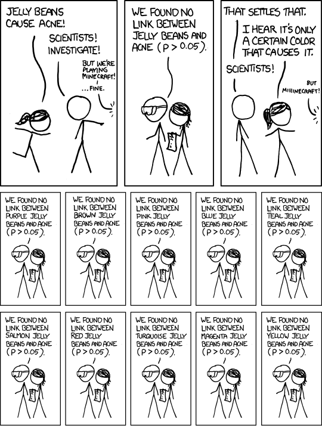
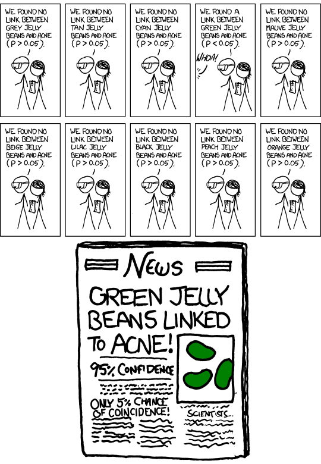

```{python}
import pandas as pd

# Real, cleaned Week 1 class data. Needed here because this session now
# opens with the hypothesis-testing content the workshop ran out of time
# for — ported from wk2/week2.qmd's own "Testing a hypothesis" section,
# added 2026-10-05 (this file previously had no Python setup chunk at all,
# since the pitfalls content that used to open it is entirely data-free).
# Same source and cleaning as the workshop deck — see its own setup-chunk
# comment for the full story.
live_df = pd.read_csv("https://raw.githubusercontent.com/stevenolanecon/7002LBSAI/main/data/week1_reaction_times_final.csv")

if 'name' in live_df.columns and 'student_name' not in live_df.columns:
    live_df = live_df.rename(columns={'name': 'student_name'})
if 'caffeine' not in live_df.columns:
    live_df['caffeine'] = 'Unknown'
live_df['caffeine'] = live_df['caffeine'].fillna('Unknown')

n_sample = int(live_df['student_name'].nunique())

live_device_stats = (
    live_df.groupby("device")["reaction_time_ms"]
    .agg(mean="mean", sd="std", n="count")
    .reset_index()
    .round(2)
    .to_dict(orient="records")
)

ojs_define(
    n_sample          = n_sample,
    live_device_stats = live_device_stats,
)
```

```{ojs}
//| output: false
{
  // Generic "shrink on reveal" wiring, used by every chart wrapped as
  // `:::: {.shrink-on-reveal data-frag="some-fragment-id" style="--large-height:...;--small-height:...;--shrink-scale:..."}`
  // Each chart renders large while its named fragment is hidden, then
  // shrinks smoothly to make room the moment that fragment is revealed.
  // Sizes live entirely in each wrapper's own inline style — this cell only
  // handles show/hide, once, for every wrapper on the page, so adding a new
  // chart to this pattern never means touching this cell.
  const wrapperFor = (fragId) => document.querySelector(`.shrink-on-reveal[data-frag="${fragId}"]`)

  // Sets each wrapper's correct starting state immediately, including on a
  // reload or direct navigation to a slide whose fragment is already shown
  // — matters because this cell (no reactive deps) only runs once, at load.
  document.querySelectorAll('.shrink-on-reveal[data-frag]').forEach(el => {
    const frag = document.getElementById(el.dataset.frag)
    el.classList.toggle('is-small', !!frag?.classList.contains('visible'))
  })

  Reveal.on('fragmentshown', (event) => {
    wrapperFor(event.fragment.id)?.classList.add('is-small')
  })
  Reveal.on('fragmenthidden', (event) => {
    wrapperFor(event.fragment.id)?.classList.remove('is-small')
  })

  // Observable Plot's `tip: true` tooltips can get stuck on screen after the
  // cursor leaves the chart — its own pointerleave handling doesn't reliably
  // fire once a chart sits inside Reveal's own scaled/transformed slide
  // stack. Safety net: on every mouse move, if a chart's tip is showing but
  // the cursor is no longer over that chart's SVG, dispatch a real
  // pointerleave at the SVG so Plot's own hide logic runs — never remove the
  // tip node directly, since Plot reuses that same element on later hovers.
  document.addEventListener('mousemove', (event) => {
    document.querySelectorAll('[aria-label="tip"]').forEach((tip) => {
      const svg = tip.closest('svg')
      const r = svg?.getBoundingClientRect()
      if (!r || r.width === 0) return
      if (event.clientX < r.left || event.clientX > r.right ||
          event.clientY < r.top || event.clientY > r.bottom) {
        svg.dispatchEvent(new PointerEvent('pointerleave', { bubbles: true }))
      }
    })
  })
}
```

```{ojs}
// Screen readers walk into an SVG's own children unless told otherwise —
// Observable Plot gives every mark and axis tick its own generic aria-label
// ("dot", "x-axis tick", ...), so without this wrapper a screen reader reads
// through dozens of those instead of one meaningful description. Wrapping in
// a role="img" container and hiding the SVG itself (aria-hidden) makes the
// wrapper's one aria-label the whole story. Same helper as wk1/week1.qmd.
function accessibleChart(node, label) {
  node.setAttribute("aria-hidden", "true")
  const wrapper = document.createElement("div")
  wrapper.setAttribute("role", "img")
  wrapper.setAttribute("aria-label", label)
  wrapper.appendChild(node)
  return wrapper
}
```

## {background-color="#1a1a2e"}

::: {style="text-align: center; padding-top: 180px;"}
[**Testing a hypothesis**]{style="font-size: 2.2em; color: white;"}

[We didn't get here in the workshop — so we're starting from scratch, then moving on to how this gets misused.]{style="font-size: 1.1em; color: #aaa; padding-top: 20px; display: block;"}
:::

## Fisher's tea test

::: {.instructions-box}
A woman claims she can tell, by taste, whether the milk or the tea was poured into the cup first.

Ronald Fisher didn't just take her word for it — and he didn't dismiss her either. He designed a test: several cups, milk-first and tea-first in random order, unknown to her. She has to identify all of them correctly.
:::

::: {.fragment}
If she's just guessing, we can calculate exactly how likely she is to get them all right by chance. If she does far better than chance predicts, that's evidence for her claim.

**This is the entire logic of hypothesis testing**, built from one experiment in 1920s Cambridge.
:::

## The logic of hypothesis testing: the setup

- Define the **statistic** we want to test, $s$ — a mean, a difference in means, anything we can estimate from data
- We're interested in its **true value**, $s_{\text{true}}$ — the value in the population, or general pattern, our data represents
- The value $s$ takes *in our own data* is an **estimate** of it, denoted with a hat: $\hat{s}$

::: {style="font-size:0.75em;color:#999;margin-top:12px;"}
Source: Békés & Kézdi (2021), Ch. 6
:::

## The logic of hypothesis testing: $H_0$ vs $H_A$

- State the question as two competing hypotheses about $s_{\text{true}}$ — only one can be true
- $H_0$, the **null hypothesis**, specifies a value (or range); $H_A$, the **alternative**, specifies the other possible values
- Together, $H_0$ and $H_A$ cover every possibility we're interested in

$$H_0: \; s_{\text{true}} = 0 \qquad H_A: \; s_{\text{true}} \neq 0$$

::: {style="font-size:0.75em;color:#999;margin-top:12px;"}
Source: Békés & Kézdi (2021), Ch. 6
:::

## The null is protected

Testing a hypothesis means asking: is there enough evidence in the data to reject a **default, protected** assumption?

::: {.two-col}
::: {.col}
**Criminal court**

- Assume innocence
- Only convict if evidence is strong
- "Not guilty" ≠ proven innocent — just not enough evidence
:::
::: {.col}
**Hypothesis testing**

- $H_0$ (null): protected, assumed true until shown otherwise
- $H_A$ (alternative): what we suspect instead
- Failing to reject $H_0$ ≠ proving it true — just not enough evidence
:::
:::

::: {style="font-size:0.75em;color:#999;margin-top:12px;"}
Source: Békés & Kézdi (2021), Ch. 6
:::

## Task — state our hypothesis

::: {.instructions-box}
Write $H_0$ and $H_A$, in words and in symbols, for our own question: does device (phone vs. laptop) affect reaction time?
:::

::: {.fragment}
$$H_0: \; \bar{x}_{\text{phone,true}} - \bar{x}_{\text{laptop,true}} = 0$$
$$H_A: \; \bar{x}_{\text{phone,true}} - \bar{x}_{\text{laptop,true}} \neq 0$$

No true difference in reaction time by device, versus: there is one.
:::

## The t-test

## The t-statistic

The test statistic measures how far our estimate is from what $H_0$ predicts, in units of standard error.

$$t = \frac{\hat{s}}{SE(\hat{s})}$$

::: {.callout-note}
$\hat{s}$ stands for **any estimated statistic** — a mean, a difference in means, or (in later weeks) a regression coefficient. The hat ($\hat{}$) is standard notation throughout this module: it marks an *estimate*, computed from our sample, as distinct from the true, unobserved population value it stands in for.
:::

**One average against a fixed number**, $\mu_0$:

$$t = \frac{\bar{x} - \mu_0}{SE(\bar{x})} \qquad SE(\bar{x}) = \frac{SD}{\sqrt{n}}$$

## The t-statistic — a difference between two averages

For $\bar{x}_A$ and $\bar{x}_B$:

$$t = \frac{\bar{x}_A - \bar{x}_B}{SE(\bar{x}_A - \bar{x}_B)} \qquad SE(\bar{x}_A - \bar{x}_B) = \sqrt{\frac{SD_A^2}{n_A} + \frac{SD_B^2}{n_B}}$$

::: {.callout-note}
This needs the *sampling distribution* of $\bar{x}_A - \bar{x}_B$ to be approximately normal — not reaction time itself, which we already know is right-skewed. With dozens of trials in each group, the CLT makes that a safe bet regardless of the raw variable's shape.
:::

::: {style="font-size:0.75em;color:#999;margin-top:12px;"}
Source: Békés & Kézdi (2021), Ch. 6
:::

## Our device data

Note: **n** here counts *trials*, not students — different from the *n* = ${n_sample} students in our class.

```{ojs}
{
  const rows = live_device_stats.filter(d => d.n >= 2)
  if (rows.length < 2) {
    return html`<div class="instructions-box">Need data from both device groups to compute this live — check back once the whole class has submitted. The formulas above still apply once the numbers are in.</div>`
  }
  return html`<table style="width:75%;margin:0 auto;border-collapse:collapse;font-family:sans-serif;font-size:0.95em;">
    <caption class="visually-hidden">Mean, standard deviation, and trial count for each device group, used to calculate the t-statistic for the device difference by hand.</caption>
    <thead><tr style="background:#1a1a2e;color:white;">
      <th scope="col" style="padding:10px 20px;text-align:left;">Device</th>
      <th scope="col" style="padding:10px 20px;text-align:right;">Mean (ms)</th>
      <th scope="col" style="padding:10px 20px;text-align:right;">SD (ms)</th>
      <th scope="col" style="padding:10px 20px;text-align:right;">n</th>
    </tr></thead>
    <tbody>
      ${rows.map((r,i) => `<tr style="${i%2===1?'background:#fafafa;':''}border-bottom:1px solid #eee;">
        <td style="padding:9px 20px;font-weight:600;">${r.device}</td>
        <td style="padding:9px 20px;text-align:right;">${r.mean}</td>
        <td style="padding:9px 20px;text-align:right;">${r.sd}</td>
        <td style="padding:9px 20px;text-align:right;">${r.n}</td>
      </tr>`).join('')}
    </tbody>
  </table>`
}
```

::: {.fragment}
**A simplifying assumption:** to keep this calculation straightforward, we're treating every trial as its own independent observation. In reality, each of our ${n_sample} students contributed several trials, so trials from the same student aren't truly independent of each other — a simplification we're making on purpose, not something that holds in the real world.
:::

## Task — calculate the t-statistic

::: {.instructions-box}
By hand or in Excel, using the table above: calculate $SE(\bar{x}_A - \bar{x}_B)$, then the t-statistic for the device difference.
:::

::: {.fragment}
```{ojs}
{
  const rows = live_device_stats.filter(d => d.n >= 2)
  if (rows.length < 2) return html`<p style="color:#aaa;">Will compute automatically once both groups have data.</p>`
  const [a, b] = rows
  const seDiff = Math.sqrt((a.sd ** 2) / a.n + (b.sd ** 2) / b.n)
  const t = (a.mean - b.mean) / seDiff
  return html`<p style="font-family:sans-serif;">t = (${a.mean} − ${b.mean}) / ${seDiff.toFixed(2)} = <strong style="color:#e63946;font-size:1.2em;">${t.toFixed(2)}</strong></p>`
}
```
:::

## Making a decision

## The critical value

A commonly used critical value for a t-statistic is **±2** (more precisely 1.96).

- Reject $H_0$ if the t-statistic is smaller than −2 or larger than +2
- Don't reject $H_0$ if it falls between −2 and +2
- This corresponds to a **5% chance of a false positive** if $H_0$ is actually true

:::: {.shrink-on-reveal data-frag="wk2online-critval-frag" style="--large-height:420px;--small-height:280px;--shrink-scale:0.6667;"}
::: {.shrink-on-reveal-inner}
```{ojs}
{
  const phi  = x => Math.exp(-0.5 * x * x) / Math.sqrt(2 * Math.PI)
  const grid = d3.range(-3.6, 3.601, 0.02).map(x => ({ x, y: phi(x) }))
  // Split each tail at x=0 so the area mark never draws a connecting
  // line across the gap in the middle of the distribution.
  const tail5L = grid.filter(d => d.x <= -1.96)
  const tail5R = grid.filter(d => d.x >=  1.96)
  const tail1L = grid.filter(d => d.x <= -2.576)
  const tail1R = grid.filter(d => d.x >=  2.576)

  return accessibleChart(Plot.plot({
    height: 420,
    marginLeft: 20,
    marginBottom: 40,
    x: { label: "t-statistic", domain: [-3.6, 3.6] },
    y: { axis: null },
    marks: [
      Plot.areaY(tail5L, { x: "x", y: "y", fill: "#e07a3f", fillOpacity: 0.3 }),
      Plot.areaY(tail5R, { x: "x", y: "y", fill: "#e07a3f", fillOpacity: 0.3 }),
      Plot.areaY(tail1L, { x: "x", y: "y", fill: "#e07a3f", fillOpacity: 0.6 }),
      Plot.areaY(tail1R, { x: "x", y: "y", fill: "#e07a3f", fillOpacity: 0.6 }),
      Plot.line(grid, { x: "x", y: "y", stroke: "#1a1a2e", strokeWidth: 2 }),
      Plot.ruleX([1.96, -1.96], { stroke: "#2a6f97", strokeWidth: 1.5, strokeDasharray: "5,4" }),
      Plot.ruleX([2.576, -2.576], { stroke: "#e07a3f", strokeWidth: 1.5, strokeDasharray: "2,3" }),
      Plot.text([{ x: 1.96, label: "1.96" }, { x: -1.96, label: "−1.96" }],
                { x: "x", y: () => phi(1.96) + 0.045, text: "label",
                  fill: "#2a6f97", fontSize: 11, fontWeight: 700 }),
      Plot.text([{ x: 2.576, label: "2.576" }, { x: -2.576, label: "−2.576" }],
                { x: "x", y: () => phi(2.576) + 0.05, text: "label",
                  fill: "#e07a3f", fontSize: 11, fontWeight: 700 }),
      Plot.text([{ x: 0, y: 0.18, label: "95%" }], { x: "x", y: "y", text: "label", fontSize: 12, fontWeight: 700 }),
      Plot.text([{ x: 3.15, y: 0.025, label: "2.5%" }, { x: -3.15, y: 0.025, label: "2.5%" }],
                { x: "x", y: "y", text: "label", fill: "#e07a3f", fontSize: 10 }),
    ]
  }), "This chart shows a Normal curve with both the 5% and 1% rejection regions shaded in the tails, illustrating why ±1.96 (or ±2 as a rule of thumb) is the usual cutoff for a 5% false-positive rate, and ±2.576 for a stricter 1%. The shaded area beyond ±1.96 makes up 5% of the distribution; the darker area beyond ±2.576 makes up 1%.")
}
```
:::
::::

::: {.fragment #wk2online-critval-frag}
Stricter critical values (±2.6) bring the false-positive rate down to 1% — at the cost of being harder to detect a real effect when one exists. The **dark** tails above are that stricter 1% cutoff; the **light + dark** together are the 5% cutoff we've been using.
:::

## Two ways to be wrong

| | $H_0$ is true | $H_0$ is false |
|---|---|---|
| **Don't reject** | True negative | False negative (Type II error) |
| **Reject** | False positive (Type I error) | True positive |

::: {.fragment}
The test is designed to make **false positives rare** — the null is protected, so we deliberately make Type I errors less likely than Type II.
:::

::: {style="font-size:0.75em;color:#999;margin-top:12px;"}
Source: Békés & Kézdi (2021), Ch. 6
:::

## The p-value

The p-value is the smallest level of significance at which we could still reject $H_0$ — the probability of seeing a test statistic this extreme, or more extreme, if $H_0$ were true.

Python gets there in one line, using the same unpooled-variance formula we just did by hand:

```python
from scipy.stats import ttest_ind

laptop = df.loc[df['device'] == 'Laptop', 'reaction_time_ms']
phone  = df.loc[df['device'] == 'Phone',  'reaction_time_ms']

t_stat, p_value = ttest_ind(laptop, phone, equal_var=False)
print("t:", round(t_stat, 3))
print("p-value:", round(p_value, 4))
```

```{python}
#| output: asis
from scipy.stats import ttest_ind

_laptop = live_df.loc[live_df['device'] == 'Laptop', 'reaction_time_ms']
_phone  = live_df.loc[live_df['device'] == 'Phone',  'reaction_time_ms']
_t_stat, _p_value = ttest_ind(_laptop, _phone, equal_var=False)
_pv_lines = (
    f"t:&nbsp;&nbsp;&nbsp;&nbsp;&nbsp;&nbsp;&nbsp;&nbsp;&nbsp;{_t_stat:.3f}<br>"
    f"p-value:&nbsp;{_p_value:.4f}"
)
print(
    '::: {style="font-family: monospace; font-size: 0.85em; background: #f8f8f8; '
    'border-left: 4px solid #457b9d; padding: 14px 20px; border-radius: 4px; line-height: 1.9;"}\n'
    f'{_pv_lines}\n:::'
)

ojs_define(device_p_value=round(float(_p_value), 4))
```

::: {.fragment}
```{ojs}
html`<p>Same t we calculated by hand two slides ago (allowing for rounding). What this p-value means: if there truly were no device effect, we'd see a gap this large (or larger) by chance with probability ${device_p_value}. Small p &rarr; strong evidence against H&#8320; — is ours actually small?</p>`
```
:::

## Task — reject, or not?

::: {.instructions-box}
Compare the t-statistic you calculated two slides ago to ±2. Reject $H_0$, or not? Write one sentence explaining what your decision means for the original business question — "is a phone-vs-laptop difference real?"
:::

## What if we had 15,000 students, not ${n_sample}?

::: {.fragment}
With a huge sample, almost any difference becomes statistically significant — the CI narrows to nearly nothing, and even a 1ms gap could reject $H_0$.
:::

::: {.fragment}
Statistical significance ≠ practical significance. At scale, the question shifts from *"is there a difference?"* to *"is the difference big enough to matter?"* — external validity remains just as important as it was at n=${n_sample}.
:::

## {background-color="#1a1a2e"}

::: {style="text-align: center; padding-top: 180px;"}
[**Testing pitfalls**]{style="font-size: 2.2em; color: white;"}

[We've just built the t-test together. Now: how it's misused — and how to pick your thresholds properly.]{style="font-size: 1.1em; color: #aaa; padding-top: 20px; display: block;"}
:::

## One-sided vs. two-sided tests

So far we've tested $H_0: s_{true} = 0$ against $H_A: s_{true} \neq 0$ — a **two-sided** test, since we don't care about the direction of the difference.

::: {.fragment}
**Example:** *does device affect reaction time?* We had no prior reason to expect phones faster than laptops, or vice versa — either direction would be a meaningful finding, so both tails count as evidence against $H_0$.

**Reject $H_0$ if** $|t| > c$ — the t-statistic is extreme in *either* direction. For a 5% test, $c \approx 1.96$: this is the same $\pm 2$ rule from the workshop, with the 5% split across both tails (2.5% each).
:::

::: {style="font-size:0.75em;color:#999;margin-top:12px;"}
Source: Békés & Kézdi (2021), Ch. 6
:::

## One-sided tests

A **one-sided** test focuses on one direction only:

$$H_0: s_{true} \leq 0 \quad \text{vs.} \quad H_A: s_{true} > 0$$

**Example:** *does caffeine reduce reaction time?* Caffeine is a stimulant — we have a specific directional prediction going in, so only a large effect in that one predicted direction counts as evidence against $H_0$.

**Reject $H_0$ if** $t > c$ — extreme in the predicted direction only. For a 5% test, $c \approx 1.645$: smaller than the two-sided threshold, because all 5% sits in one tail instead of being split.

::: {.fragment}
Same overall false-positive rate (5%) either way — but the one-sided test is more powerful for an effect in the predicted direction (a smaller $t$ clears the lower bar), at the cost of **zero power** to detect an effect in the other direction, however large.
:::

::: {style="font-size:0.75em;color:#999;margin-top:12px;"}
Source: Békés & Kézdi (2021), Ch. 6
:::

## What p-value threshold should you pick?

There's no universal answer — it's a trade-off, and it depends on what's at stake.

| Scenario | Suggested threshold |
|---|---|
| "Guilty beyond reasonable doubt" — a costly, hard-to-reverse decision | Conservative: 1% or lower |
| "Proof of concept" — deciding whether to investigate further | Looser: 10–15% is often fine |

::: {.fragment}
A result significant at 10–15% is still informative — it's much more likely to be real than not. It just means: worth another look, more data, more experimentation, before betting the business on it.
:::

::: {style="font-size:0.75em;color:#999;margin-top:12px;"}
Source: Békés & Kézdi (2021), Ch. 6
:::

## Size and power

**Size** of the test — under $H_0$: the probability of a false positive. We fix this in advance (usually 5% or 1%) — the **level of significance**.

**Power** of the test — under $H_A$: the probability of *avoiding* a false negative.

::: {.fragment}
Power is higher when:

- the sample is larger
- the dispersion (SD) is smaller
- the true effect is further from the null
:::

## Visualising size and power {.smaller}

```{ojs}
viewof effect_size = {
  const f = html`<div style="display:flex;align-items:center;gap:14px;font-size:13px;
                              font-family:'Helvetica Neue',sans-serif;padding:4px 2px;color:#333;">
    <span style="color:#666;white-space:nowrap;">True effect (in SE units)</span>
    <input type="range" min="0" max="5" step="0.25" value="2.5"
           style="width:180px;cursor:pointer;accent-color:#457b9d;">
    <span id="es-label" style="font-weight:700;min-width:32px;color:#457b9d;">2.5</span>
  </div>`
  const slider = f.querySelector('input')
  const label  = f.querySelector('#es-label')
  slider.addEventListener('input', () => {
    label.textContent = slider.value
    f.dispatchEvent(new CustomEvent('input'))
  })
  Object.defineProperty(f, 'value', { get: () => +slider.value })
  return f
}
```

:::: {.shrink-on-reveal data-frag="wk2online-power-frag"
      style="--large-height:460px;--small-height:320px;--shrink-scale:0.696;"}
::: {.shrink-on-reveal-inner}
```{ojs}
{
  // Two-sided throughout, matching the ±2 rule-of-thumb from the workshop:
  // both the rejection region (size) and the power calculation need to
  // account for BOTH tails, or the dashed lines at ±crit would be showing
  // a boundary that the shaded regions and the power number don't actually
  // use.
  const mu0 = 0, mu1 = effect_size, sigma = 1, crit = 2
  const xs = d3.range(-5, 7.51, 0.05)
  const pdf = (x, mu) => (1 / (sigma * Math.sqrt(2 * Math.PI))) * Math.exp(-0.5 * ((x - mu) / sigma) ** 2)
  const nullCurve = xs.map(x => ({ x, y: pdf(x, mu0) }))
  const altCurve  = xs.map(x => ({ x, y: pdf(x, mu1) }))

  const nullRejectHi = xs.filter(x => x > crit).map(x => ({ x, y: pdf(x, mu0) }))
  const nullRejectLo = xs.filter(x => x < -crit).map(x => ({ x, y: pdf(x, mu0) }))
  const altMiss   = xs.filter(x => x > -crit && x < crit).map(x => ({ x, y: pdf(x, mu1) }))
  const altHitHi  = xs.filter(x => x > crit).map(x => ({ x, y: pdf(x, mu1) }))
  const altHitLo  = xs.filter(x => x < -crit).map(x => ({ x, y: pdf(x, mu1) }))

  function normCdf(z) { return 0.5 * (1 + erf(z / Math.SQRT2)) }
  function erf(x) {
    const sign = x < 0 ? -1 : 1
    x = Math.abs(x)
    const a1=0.254829592, a2=-0.284496736, a3=1.421413741, a4=-1.453152027, a5=1.061405429, p=0.3275911
    const t = 1/(1+p*x)
    const y = 1 - (((((a5*t+a4)*t)+a3)*t+a2)*t+a1)*t*Math.exp(-x*x)
    return sign*y
  }

  const size  = 2 * (1 - normCdf(crit))                             // both tails, under H0
  const power = (1 - normCdf(crit - mu1)) + normCdf(-crit - mu1)     // both tails, under H1

  return accessibleChart(Plot.plot({
    height: 460,
    marginLeft: 50,
    marginBottom: 34,
    x: { label: "t-statistic", domain: [-5, 7.5] },
    y: { label: "density" },
    marks: [
      Plot.areaY(nullRejectHi, { x: "x", y: "y", fill: "#e63946", fillOpacity: 0.55 }),
      Plot.areaY(nullRejectLo, { x: "x", y: "y", fill: "#e63946", fillOpacity: 0.55 }),
      Plot.areaY(altMiss,      { x: "x", y: "y", fill: "#f4a261", fillOpacity: 0.45 }),
      Plot.areaY(altHitHi,     { x: "x", y: "y", fill: "#2d6a4f", fillOpacity: 0.35 }),
      Plot.areaY(altHitLo,     { x: "x", y: "y", fill: "#2d6a4f", fillOpacity: 0.35 }),
      Plot.line(nullCurve, { x: "x", y: "y", stroke: "#1a1a2e", strokeWidth: 2 }),
      Plot.line(altCurve,  { x: "x", y: "y", stroke: "#457b9d", strokeWidth: 2 }),
      Plot.ruleX([crit, -crit], { stroke: "#666", strokeWidth: 1, strokeDasharray: "4,3" }),
      Plot.ruleY([0]),
      Plot.text([{ x: -5, y: pdf(0,0)*1.08, label: `Size ≈ ${(size*100).toFixed(1)}%` }],
                { x: "x", y: "y", text: "label", textAnchor: "start", fill: "#e63946", fontSize: 13, fontWeight: 700 }),
      Plot.text([{ x: -5, y: pdf(0,0)*0.94, label: `Power ≈ ${(power*100).toFixed(0)}%` }],
                { x: "x", y: "y", text: "label", textAnchor: "start", fill: "#2d6a4f", fontSize: 13, fontWeight: 700 }),
    ]
  }), `This chart shows two overlapping sampling distributions — one under the null hypothesis, one under the alternative — with the rejection region shaded to show how size and power relate to each other as the true effect size changes. At the current effect size of ${effect_size}, the test's size is ${(size*100).toFixed(1)}% and its power is ${(power*100).toFixed(0)}%.`)
}
```
:::
::::

::: {.fragment #wk2online-power-frag}
Black = the sampling distribution under $H_0$ (no effect). Blue = under $H_A$, at whatever effect size the slider is set to. The dashed lines are the same $\pm 2$ critical values from the last slide — reject $H_0$ outside them. Red = Type I error (size) — fixed by the critical value, not the slider. Orange = Type II error: alternative-curve mass still inside the "don't reject" zone. Green = power: what's left.

Drag the slider right and the blue curve slides away from black — less of it falls between the dashed lines, more clears them. That's "the true effect is further from the null" from two slides ago, made concrete. Drag to 0 and the curves merge completely: no real effect, so only the fixed false-positive rate remains.
:::

::: {style="font-size:0.75em;color:#999;margin-top:4px;"}
Pattern after Békés & Kézdi (2021), Ch. 6
:::

## Multiple testing: the motivation

A medical dataset: 400 patients, a heart-disease indicator, and 100 lifestyle features — diet, exercise, income, sleep, dozens more.

::: {.fragment}
Test each feature against heart disease, one by one, at 5% significance. You find six with a "significant" link.

**Is that a discovery?**
:::

## Simply by chance

If **all 100** null hypotheses were actually true — no real links exist anywhere — a 5% false-positive rate means we'd still expect to reject **5 of them**, purely by chance.

::: {.fragment}
Picking out those five and writing them up as findings is exactly backwards: we started by assuming none of them were real.
:::

::: {style="font-size:0.75em;color:#999;margin-top:12px;"}
Source: Békés & Kézdi (2021), Ch. 6
:::

## The jelly bean problem

::: {style="text-align:center;"}
```{=html}
<a href="images/xkcd-significant-top.png" target="_blank" style="text-decoration:none;">
  
</a>
```
:::

::: {style="font-size:0.7em;color:#999;text-align:center;margin-top:8px;"}
XKCD #882, "Significant" — Randall Munroe, CC BY-NC 2.5 — click to view full size (1 of 2)
:::

## The jelly bean problem (continued)

::: {style="text-align:center;"}
```{=html}
<a href="images/xkcd-significant-bottom.png" target="_blank" style="text-decoration:none;">
  
</a>
```
:::

::: {style="font-size:0.7em;color:#999;text-align:center;margin-top:8px;"}
XKCD #882, "Significant" — Randall Munroe, CC BY-NC 2.5 — click to view full size (2 of 2)
:::

## Fixing it

Testing many hypotheses at once needs a stricter bar than testing one.

- **Simple fix:** for a few dozen tests, use a much stricter threshold — 0.1–0.5% instead of 5%
- **Bonferroni correction:** divide your target p-value by the number of tests. Aiming for 5% across 20 hypotheses → reject only below 0.05/20 = 0.0025
- Often criticised as **too strict** — but a reasonable default when you don't know better

::: {.fragment}
**p-hacking**: running many tests (or many versions of one test) and reporting only the ones that "worked." The jelly-bean comic, deliberately.
:::

::: {style="font-size:0.75em;color:#999;margin-top:12px;"}
Source: Békés & Kézdi (2021), Ch. 6
:::

## Testing when the data is huge

With millions of observations, statistical inference starts to lose relevance — confidence intervals become vanishingly narrow, and almost **any** difference becomes "statistically significant," including ones too small to matter economically.

::: {.fragment}
The question shifts from *"is there a difference?"* to *"is the difference big enough to matter?"* — look at the size of the effect, not just whether it clears a p-value bar.

External validity remains just as important at scale as it was with 15 observations.
:::

::: {style="font-size:0.75em;color:#999;margin-top:12px;"}
Source: Békés & Kézdi (2021), Ch. 5 & 6
:::

## AI: asking for a formula

Gabor & Kézdi tried asking an AI for the two-sample t-test formula. It came back mostly right — but "mostly" is the operative word.

::: {.fragment}
AI tools are good at explaining concepts, deriving formulas, and calculating statistics from data you give them. Use them that way — but **check the output**, the same way you'd check a classmate's working. Wrong formulas read just as fluently as right ones.
:::

::: {style="font-size:0.75em;color:#999;margin-top:12px;"}
Source: Békés & Kézdi (2021), Ch. 5 & 6
:::

## Coming up: Week 3

::: {style="text-align: center; padding-top: 60px;"}
[We now have a way to test whether **one** difference is real.]{style="font-size: 1.3em;"}

[But most interesting questions involve the relationship between **two variables**.]{style="font-size: 1.3em; padding-top: 20px; display:block;"}

[**When y met x: correlation and covariance**]{style="font-size: 1.4em; color: #2d6a4f; padding-top: 20px; display:block;"}

::: {.fragment style="padding-top:40px;"}
*Conditional probability · covariance · correlation · spurious correlation*
:::
:::
